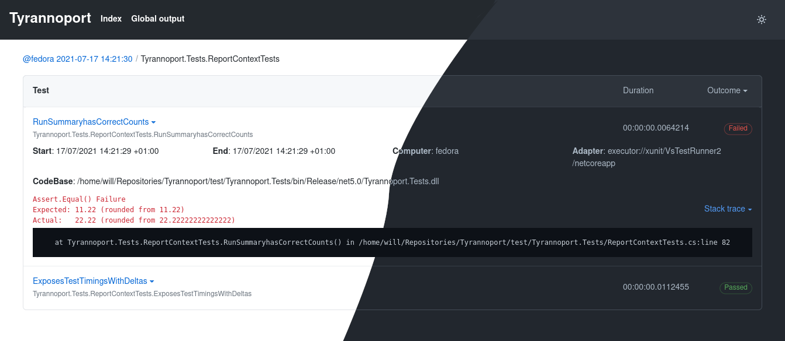

# Tyrannoport

[](https://dev.azure.com/iwillspeak/GitHub/_build/latest?definitionId=8&branchName=main)
[](https://www.fuget.org/packages/Tyrannoport)

🦖 For processing TRX files into something more enjoyable 🦖




## Installation

Tyrannoport is a `dotnet` tool. It can be installed either to a project's
local `dotnet-tools.json`, or globally.

```bash
$ dotnet tool install tyrannoport
```

Or to install globally

```bash
$ dotnet tool install --global tyrannoport
```

The tool can then be run as either `tyrannoport`, or
`dotnet tool run tyrannoport`. 

## Usage

Tyrannoport takes one or more TRX file names and generates HTML reports next to
them.

```
$ tyrannoport [report.trx]+
```

### Cake Build

Tyrannoport can be called directly from Cake build scripts. You will need to
have both the `Tyrannoport` tool, and the `Cake.Tyrannoport` package installed:

```cake
#tool "dotnet:?package=Tyrannoport&version=0.3.14"
#addin "nuget:?package=Cake.Tyrannoport&version=0.3.14"
```

Then in your `build.cake` you can call Tyrannoport:

```c#
Task("Report")
    .IsDependentOn("Test")
    .Does(() =>
{
    Tyrannoport(trxPath);
});
```

For more details [see the example Cake project](https://gist.github.com/iwillspeak/85ecff08bfd587d2a98272f1dd1a2698).

## Here be Dragons

Tyrannoport is still under active development. The current tool should be
useful but some features are yet to be fully implemented.

This is a rough roadmap:

 * [x] Parse raw TRX data
 * [x] Templating of overview page from parsed report
 * [x] Templating of test results pages from parsed report
 * [x] Fixup navigation + breadcrumbs.
 * [x] Support more target frameworks (`netcoreapp3.1` might be nice)
 * [x] Document usage in README
 * [x] JS to allow switching to dark mode
 * [x] JS to allow filtering by outcome
 * [-] Nuke and Cake plugins / docs
    * [x] Cake build support
    * [ ] Nuke build support
 * [ ] Command line argument parsing (`--output` etc.)
 * [ ] Bake in CSS rather than referencing unpkg
 * [ ] Add `tyrannoport summarise` command to generate an overview page?

## License

Tyrannoport is [licensed under the MIT license](LICENSE.txt). 
