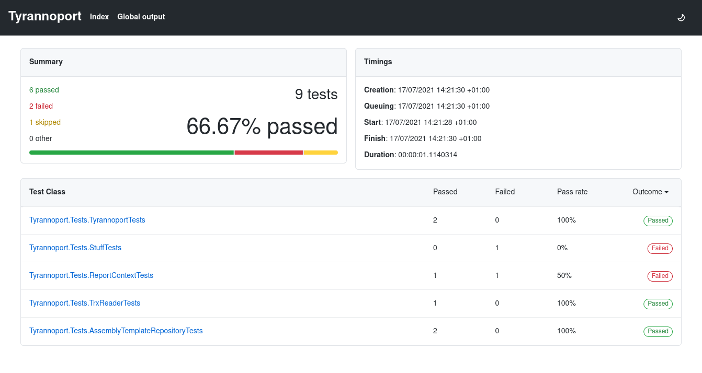

# Tyrannoport

🦖 For processing TRX files into something more enjoyable 🦖




## Installation

Tyrannoport is a `dotnet` tool. It can be installed either to a project's
local `dotnet-tools.json`, or globally.

```bash
$ dotnet tool install tyrannoport
```

Or to install globally

```bash
$ dotnet tool install --global tyrannoport
```

The tool can then be run as either `tyrannoport`, or
`dotnet tool run tyrannoport`. 

## Usage

Tyrannoport takes one or more TRX file names and generates HTML reports next to
them.

```
$ tyrannoport [report.trx]+
```

## Here be Dragons

TODO: 

 * [x] Parse raw TRX data
 * [x] Templating of overview page from parsed report
 * [x] Templating of test results pages from parsed report
 * [x] Fixup navigation + breadcrumbs.
 * [x] Support more target frameworks (`netcoreapp3.1` might be nice)
 * [x] Document usage in README
 * [x] JS to allow switching to dark mode
 * [ ] Command line argument parsing (`--output` etc.)
 * [ ] Nuke and Cake plugins / docs
 * [ ] JS to allow filtering by outcome
 * [ ] Bake in CSS & js rather than referencing unpkg
 * [ ] Add `tyrannoport summarise` command to generate an overview page?